# **Conduit**

A communications consolidation app for Android - A single feed for your messages and alerts.

Conduit pulls messages and notifications from your communication apps into a single place, so you can action them quickly without app hopping, see a chronological timeline of when things came in, and search past communications and notifcations from one spot.

Conduit is on-device by design. It does not use APIs from the communication apps it supports. Instead, it relies on the notifications those apps post.

This repo hosts the releases and updates for the app. I have another repo which is the actually app code. 

>Hello! Before continuing, I just want to inform you that Conduit is a 85-90% AI coded app. I fully understand that is not every persons cup of tea so I want to be upfront.
>
>I have wanted to make Android/mobile apps since I can remember but never could get myself to learn how to do it - struggled in coding in school and by the time I could spend time to prioritize working on learning, my career took me down the Product >Management path instead of development.
>
>AI has helped me tremendously in slowly learning how to code but nothing to this magnitude yet all by myself. My knowledge and skills in product management have helped me build Conduit in an iterative, structure way.
>
>If you are interested in my build process with AI & Product Management, drop me a message! If an AI assisted built app isn't for you 100% get it.

### Screenshots

Conduit Main

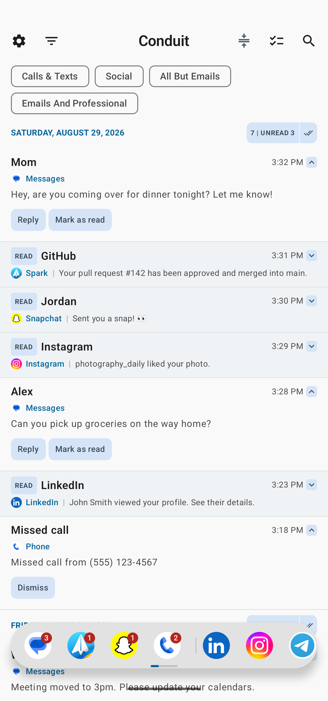

Custom Views

| Calls & Texts | Social |
| :---: | :---: |
| 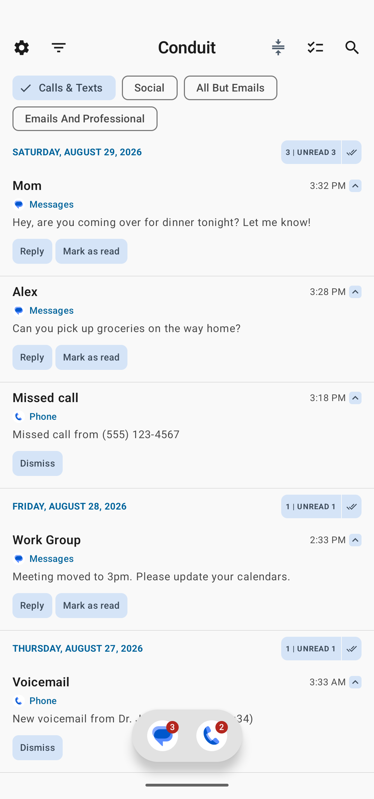 | 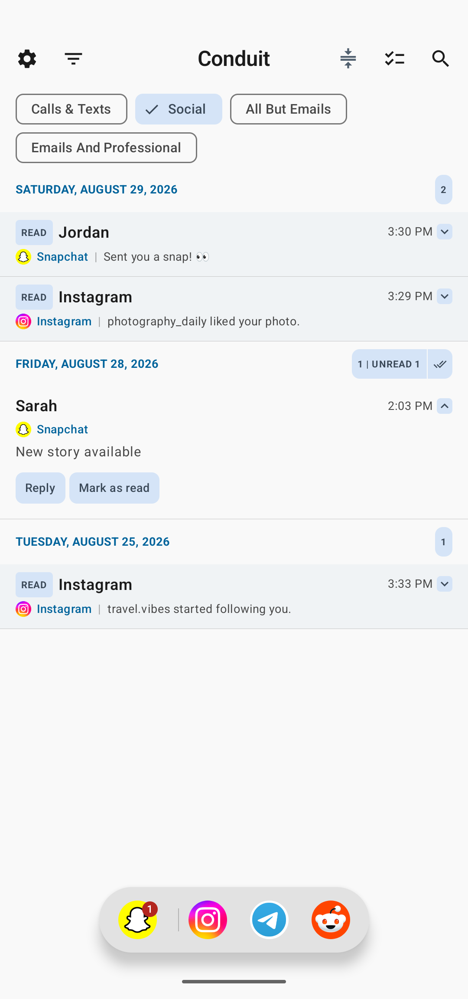 |
| Emails & Professional | All But Emails (unfiltered dock) |
| 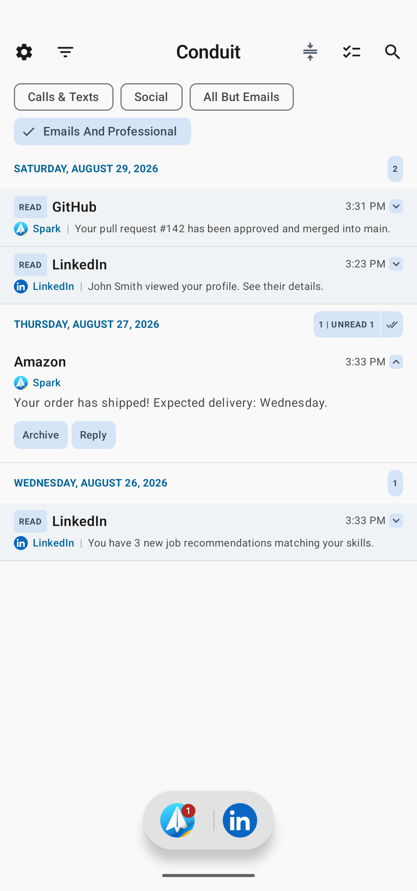 | 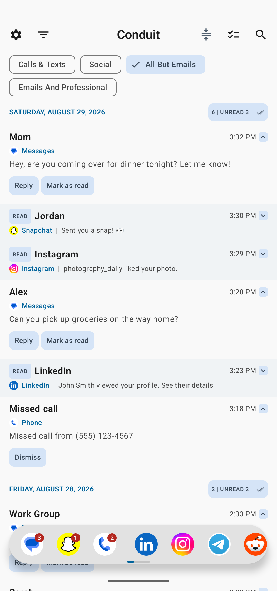 |

Todo Mode and Themes

| Todo Mode | AMOLED Black | AMOLED + Monochrome Icons |
| :---: | :---: | :---: |
| 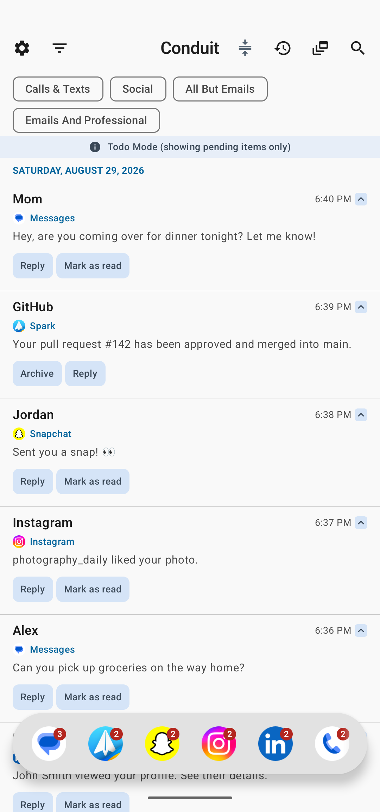 | 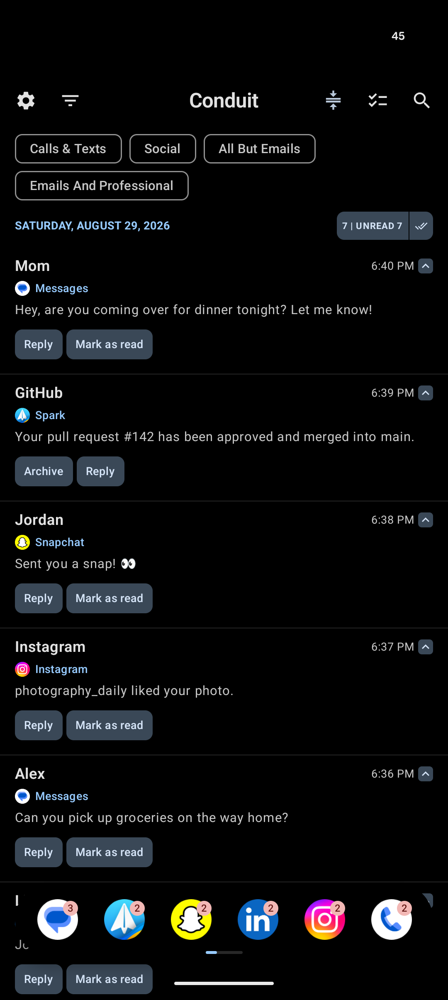 | 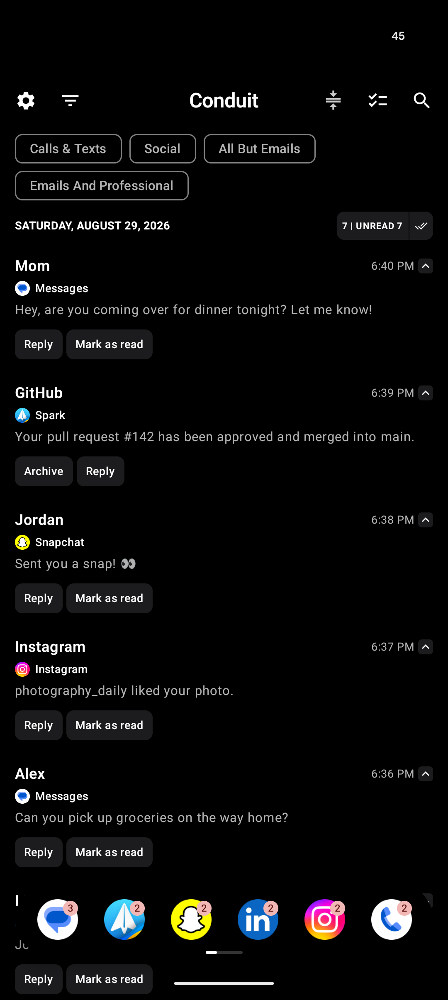 |

Unread Dock

Unread badges per channel:

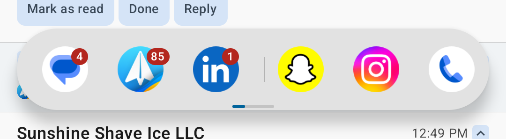

Selected app state:

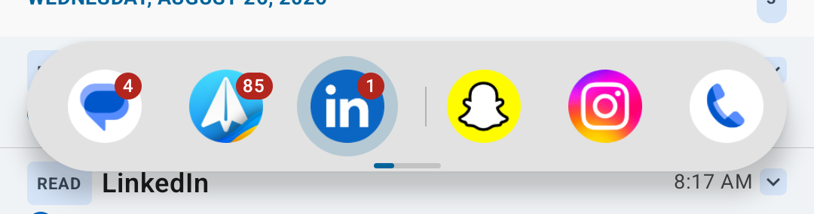

Scrollability fade indicator:

Channels and Supported Apps

| Channel toggles | Supported apps and package names |
| :---: | :---: |
| 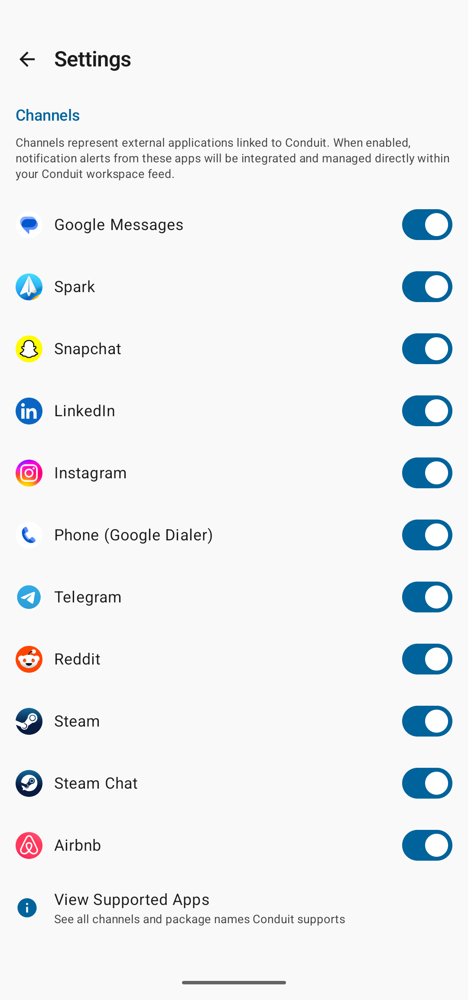 | 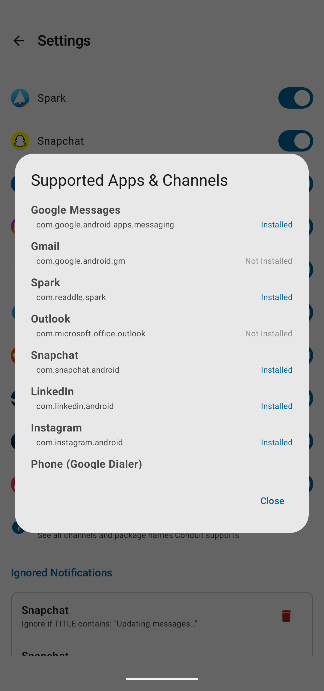 |

Settings

| Updates and theme | Layout and swipe gestures |
| :---: | :---: |
| 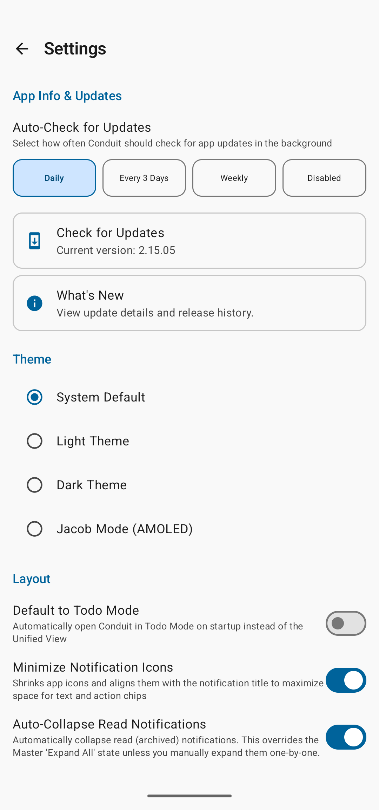 | 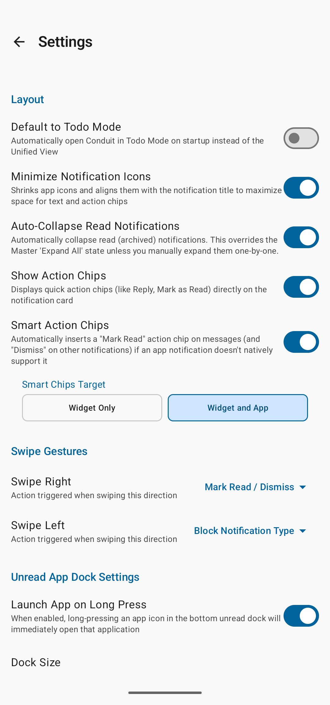 |

App launcher icon:

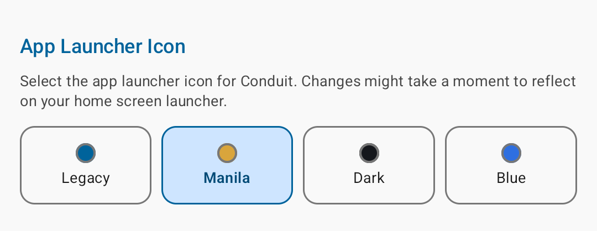

Notification retention:

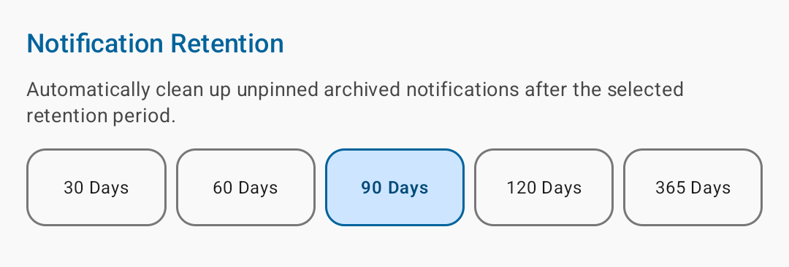

Ignored and blocked notifications:

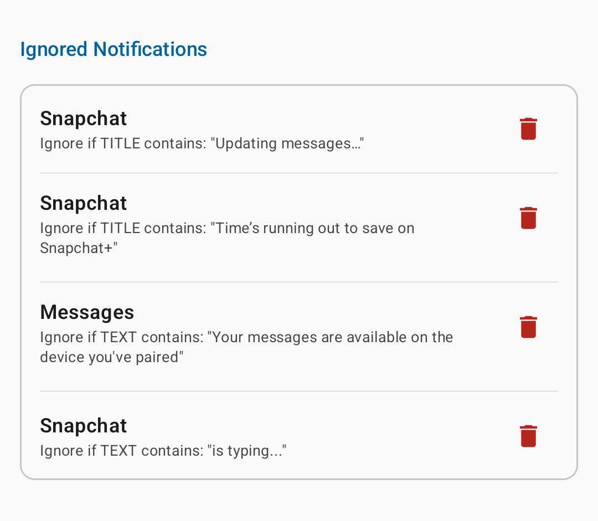

### Features

- Combine messages and notifications from supported channels into a single place
- Widget support
  - Complete mirror of unactioned messages/notifications in Conduit onto your homescreen
  - Custom Views Widget for just displaying unactioned messages/notifications for specific apps in your Custom Views (read on for details about custom views)
- Sync dismissal of native Android notifications to message and notification entries in Conduit
  - Including a semi-intelligent sync system that distinguishes between messages and non-message notifications that prioritizes not dismissing messages until you purposefully action them. That way messages you have pending don't get "lost" on a reboot.
- Large list of supported channels (and growing! request ones you don't see supported yet)
- Toggle installed and supported channels on and off
  - In case you do not care to have a specific app included in Conduit
- Todo Mode to filter out everything except unread to quickly action
- Pin messages/notifications to the top of Conduit
- Dock with unread badges
  - Change Dock Size
  - Change scroll-ability indicator
  - Long press to launch app from dock (can be turned on and off from settings)
- Custom Views
  - Custom views allow you to narrow down to just specific apps while in that view
  - Filter out all apps other than the ones included in the view from the app dock
  - Set a custom view as the default view for Conduit
- Search across all messages and notifications for supported channels
- Action notifications quickly, with each channel's own notification action chips available inside Conduit
  - Because of this, you may be able to customize the action buttons on the channel's notifications depending on if the app supports it
  - Can be turned on or off in settings
- Block or hide notifications by matching on title, body content, or both
- Smart Action Chips
  - Automatically add a "Mark Read" on messaging apps that don't support it natively in their notification actions
  - Automatically add a "Dismiss" action chip for non-messages with no "Mark Read" native actions
- Customizable retention period
  - 30 days, 60, 90, 120, 365
- Auto update checker configuration (update feature is designed to point at this repo and check for most recent releases)
  - Daily, Every 3 Days, Weekly, Disabled
  - Include manual check

**Customizable:**

- Default to Todo Mode
- Minimize Notification Icons (gives you more space for text, useful for small screens like Titan Elite 2, Titan 1/2/Slim/etc, Clicks, Minimal Phone 2)
- Swipe actions on message and notification entries
  - Swipe left, swipe right
- Theme options
  - Dark/Light
  - AMOLED black
    - With or without monochrome icons

***Seriously* Beta:**

- Hangar - quickly get to chats and notifications from a sidebar handle
- App Bundles - Quickly launch your notes, recorder, AI apps, and compose

### Supported Channels (Feel free to request more!)

| Category | Channels |
| :--- | :--- |
| Basic Comms | Google Messages, System Phone (Google / Samsung Dialer), Truecaller |
| Social Media | Facebook, Facebook Messenger, Instagram, Snapchat, Twitter (X), Reddit, Telegram, Telegram X |
| Professional | Gmail, Spark Email, Outlook, Microsoft Teams, LinkedIn |
| Misc | Steam, Steam Chat, Airbnb |

#### Methodology and product strategy with Conduit

I built Conduit in a way for it to "integrate" into the already existing Android settings and features as much as possible. This can be seen in mirroring the native notifications, their action chips, utilizing native Android snooze, expand and compact notifications like native notification shade, familiar app dock, etc. That is always one of my guiding principles with the strategy of Conduit as I look at adding new features.

#### Why I built "Conduit"

Back in the day I used a Blackberry as my primary device - loved the focus it had on quickly getting through your comms and combining things into a single hub. Eventually, moved around different smart phones (always Android!) and then Blackberry came out with the Blackberry Priv which I loved despite its faults. The standout feature for me was the Blackberry Hub. Once again, was able to get everything in one place and quickly move through items. Plus customize the view I was using to get through comms. I know that Blackberry still has that in some form with Inbox but I wanted to take a fundamentally different approach with keeping everything on device without APIs needed to pick up messages and comms. I also wanted even more customization.

#### How Updates Work

Releases are built and tested locally on my Pixel 10 Pro, with a Titan Slim as a secondary test device. Once a build is ready to publish, the APK is pushed to this repo.
Inside the app, a background worker checks the GitHub API for a newer version tag on an interval you can configure in Settings. If an update exists, an Update Available button appears to the left of the Conduit title at the top of the main page. Tapping it hands off to Android's native DownloadManager, which quietly downloads the APK in the background (posts a notification) and then triggers the standard Android package installer prompt.

### Reporting an Issue or Feature Request

To report a bug with Conduit or request a feature (like a new channel support), just utilize the Github "Issue" tab. [How to file an issue on Github](https://docs.github.com/en/issues/tracking-your-work-with-issues/learning-about-issues/quickstart) Or just let me know on whatever site you found this on (Reddit, LinkedIn, whatever).

------

